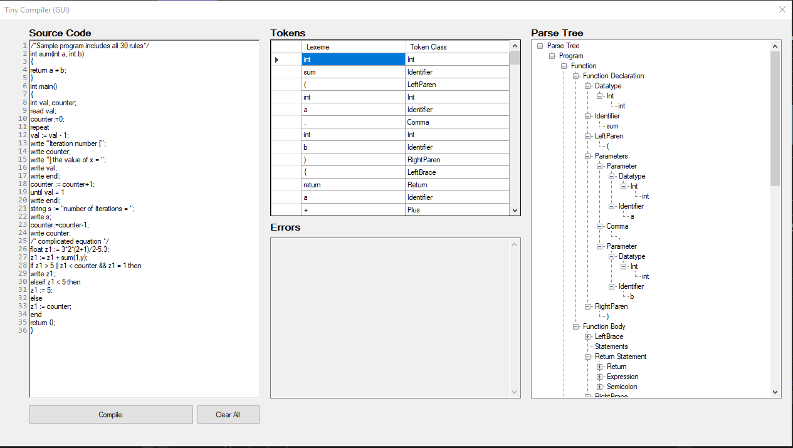

# Tiny Compiler

A two-phase **Tiny** language compiler built with C# and WindowsForms using .NET framework. This is **NOT a full compiler**; it only handles the lexical analysis and parsing phases only.

## Implementation

The compiler is implemented in C# and uses WindowsForms for the user interface. Allowing users to interact with the compiler through a simple GUI, where they can load Tiny Language source files and view the tokenization and parse tree results.

## Context Free Grammar (CFG)

Tiny PL language specification can be found [here](./docs/tiny-pl-language-description.pdf). For details on the syntax and grammar of the Tiny Language, refer to the [CFG document](docs/CFG-EBNF.md).
