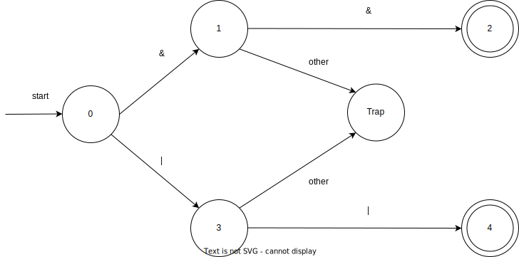
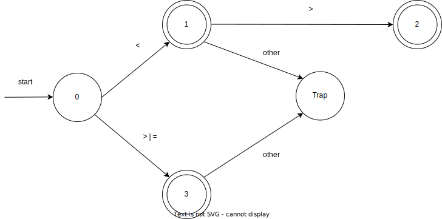

# Tiny Language Tokens Regex

---

### Reserved Keywords:

Regex:

```regex
int|float|string|read|write|repeat|until|if|elseif|else|then|return|end|endl
```
---
<!-- _class: reserved -->

DFA:


---
### Number:

Regex:

```regex
[0-9]+(\.[0-9]+)?
```

DFA:


---

### String

Regex:

```regex
"([a-zA-Z0-9-!#$%&'()*+,./:;<=>?@[\\\]_`{|}~]|(\"))*"
```

DFA:


---

## Other Operators:

Regex:

```regex
{|}|(|)|;|,
```

DFA:


---

### Identifier

Regex:

```regex
[a-zA-Z][a-zA-Z0-9]*
```

DFA:


---

### Arithmetic Operators + Assignment Operator:

Regex:

```regex
+ | - | * | / | :=
```

DFA:


---

### Comment

Regex:

```regex
/\*[a-zA-Z0-9-*!#$%&'()+,./:;<=>?@[]_{|}~]*\*/
```

DFA:


---

### Boolean Operators

Regex:

```regex
&& | ||
```

DFA:



---

### Condition Operators

Regex:

```regex
< | > | = | <>
```

DFA:



<style>
    img[src*="reserved-keywords-dfa.svg"] {
    width: 65%;
    height: 100%;
}
</style>

